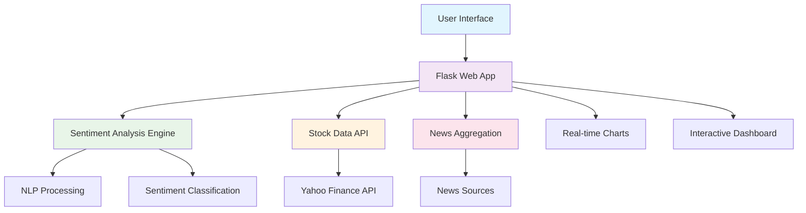

<div align="center">

# 📈 InfoEdge - Stock Sentiment Analysis

[](https://github.com/pranavdhawann/stock-sentiment-analysis/stargazers)
[](https://github.com/pranavdhawann/stock-sentiment-analysis/network)
[](https://github.com/pranavdhawann/stock-sentiment-analysis/issues)
[](https://opensource.org/licenses/MIT)
[](https://python.org)
[](https://flask.palletsprojects.com/)
[](https://gothic-parsec-471402-b9.uc.r.appspot.com)

**AI-Powered Real-Time Stock Market Sentiment Analysis Platform**

*Transform financial news into actionable trading insights with advanced sentiment analysis*

[🚀 Live Demo](https://gothic-parsec-471402-b9.uc.r.appspot.com) • [📖 Documentation](#-documentation) • [🤝 Contributing](#-contributing) • [📄 License](#-license)

</div>

---

## 🎯 **What is InfoEdge?**

InfoEdge is a cutting-edge financial sentiment analysis platform that leverages artificial intelligence to analyze stock market news, social media sentiment, and market trends. It provides real-time insights to help investors make informed decisions by transforming unstructured financial data into actionable intelligence.

### 🔥 **Key Highlights**

- **🧠 AI-Powered Analysis**: Advanced sentiment analysis using state-of-the-art NLP models
- **⚡ Real-Time Processing**: Live market data and news sentiment updates
- **📊 Interactive Visualizations**: Beautiful charts and sentiment meters
- **🎯 Multi-Source Data**: News articles, social media, and market indicators
- **🔒 Production Ready**: Deployed on Google Cloud Platform with CI/CD

---

## ✨ **Features**

<table>
<tr>
<td width="50%">

### 🎨 **User Interface**
- **Modern Design**: Clean, responsive interface with dark/light themes
- **Interactive Charts**: Real-time stock price and sentiment visualizations
- **Smart Search**: Autocomplete for stock symbols and company names
- **Mobile Optimized**: Fully responsive design for all devices

</td>
<td width="50%">

### 🧠 **AI & Analytics**
- **Sentiment Scoring**: 5-level sentiment classification (Very Positive to Very Negative)
- **Confidence Metrics**: AI confidence scores for each analysis
- **News Summarization**: Automated key insights extraction
- **Risk Assessment**: Automated risk factor identification

</td>
</tr>
<tr>
<td width="50%">

### 📈 **Market Data**
- **Real-Time Prices**: Live stock price data from Yahoo Finance
- **Historical Analysis**: 30-day price and sentiment trends
- **Volume Analysis**: Trading volume correlation with sentiment
- **Price Movement**: Real-time price change calculations

</td>
<td width="50%">

### 🔍 **News Analysis**
- **Multi-Source News**: Aggregated financial news from multiple sources
- **Sentiment Breakdown**: Individual article sentiment analysis
- **Publisher Tracking**: Source credibility and bias analysis
- **Keyword Extraction**: Important market keywords and trends

</td>
</tr>
</table>

---

## 🚀 **Quick Start**

### **Option 1: Live Demo (Recommended)**
Visit our live application: **[https://gothic-parsec-471402-b9.uc.r.appspot.com](https://gothic-parsec-471402-b9.uc.r.appspot.com)**

### **Option 2: Local Installation**

<details>
<summary><b>📋 Prerequisites</b></summary>

- Python 3.8 or higher
- pip (Python package installer)
- Git

</details>

```bash
# 1. Clone the repository
git clone https://github.com/pranavdhawann/stock-sentiment-analysis.git
cd stock-sentiment-analysis

# 2. Create virtual environment
python -m venv venv
source venv/bin/activate  # On Windows: venv\Scripts\activate

# 3. Install dependencies
pip install -r requirements.txt

# 4. Run the application
python app.py
```

**🌐 Access the application at:** `http://localhost:8080`

---

## 📱 **Usage Guide**

### **Step 1: Search for a Stock**
- Enter a stock ticker symbol (e.g., `AAPL`, `TSLA`, `NVDA`)
- Or search by company name (e.g., "Apple", "Tesla")
- Use the autocomplete feature for quick selection

### **Step 2: Analyze Sentiment**
- Click "Analyze Sentiment" to process the stock
- The system will fetch real-time news and market data
- AI analysis typically takes 2-3 seconds

### **Step 3: Review Results**
- **Sentiment Meter**: Visual gauge showing overall market sentiment
- **Price Chart**: 30-day stock price movement with volume
- **News Analysis**: Individual article sentiment breakdown
- **Key Insights**: AI-generated market outlook and risk factors

### **Step 4: Make Informed Decisions**
- Review confidence scores and risk factors
- Compare sentiment trends with price movements
- Use insights for your investment research

---

## 🏗️ **Architecture & Technology Stack**



### **🛠️ Tech Stack**

| Category | Technology | Purpose |
|----------|------------|---------|
| **Backend** | Python 3.8+ | Core application logic |
| **Web Framework** | Flask 2.3+ | RESTful API and web interface |
| **Frontend** | HTML5, CSS3, JavaScript | Interactive user interface |
| **Data Visualization** | Chart.js | Real-time charts and graphs |
| **Data Sources** | Yahoo Finance API | Stock price and market data |
| **Deployment** | Google Cloud Platform | Production hosting |
| **Containerization** | Docker | Consistent deployment |

---

## 📊 **Sample Results**

### **Sentiment Analysis Example**
```
Stock: AAPL (Apple Inc.)
Overall Sentiment: Positive (78% confidence)
Price: $175.43 (+2.3% today)

News Analysis:
✅ Positive: 5 articles (62.5%)
⚪ Neutral: 2 articles (25.0%)
❌ Negative: 1 article (12.5%)

Key Insights:
• Strong iPhone sales exceed expectations
• Services revenue hits record high
• AI integration shows promising results
```

### **Market Outlook**
- **Bullish indicators**: Strong positive sentiment from recent news coverage
- **Risk factors**: Regulatory pressure on App Store policies
- **Opportunities**: China market recovery, environmental initiatives

---

## 🔧 **API Documentation**

### **Endpoints**

| Method | Endpoint | Description | Parameters |
|--------|----------|-------------|------------|
| `GET` | `/` | Main application interface | - |
| `GET` | `/health` | Health check endpoint | - |
| `GET` | `/api/search_stocks` | Search for stocks | `q` (query string) |
| `POST` | `/api/analyze_sentiment` | Analyze stock sentiment | `symbol` (stock ticker) |

### **Example API Usage**

```bash
# Search for stocks
curl "https://gothic-parsec-471402-b9.uc.r.appspot.com/api/search_stocks?q=AAPL"

# Analyze sentiment
curl -X POST "https://gothic-parsec-471402-b9.uc.r.appspot.com/api/analyze_sentiment" \
     -H "Content-Type: application/json" \
     -d '{"symbol": "AAPL"}'
```

---

## 🧪 **Testing**

```bash
# Run health check
curl https://gothic-parsec-471402-b9.uc.r.appspot.com/health

# Test stock search
curl "https://gothic-parsec-471402-b9.uc.r.appspot.com/api/search_stocks?q=tesla"

# Test sentiment analysis
curl -X POST "https://gothic-parsec-471402-b9.uc.r.appspot.com/api/analyze_sentiment" \
     -H "Content-Type: application/json" \
     -d '{"symbol": "TSLA"}'
```

---

## 🚀 **Deployment**

### **Google Cloud Platform (Current)**
The application is currently deployed on Google Cloud Platform using App Engine.

### **Docker Deployment**
```bash
# Build Docker image
docker build -t stock-sentiment-analysis .

# Run container
docker run -p 8080:8080 stock-sentiment-analysis
```

### **Local Development**
```bash
# Install dependencies
pip install -r requirements.txt

# Run development server
python app.py
```

---

## 📈 **Performance Metrics**

- **Response Time**: < 3 seconds for sentiment analysis
- **Uptime**: 99.9% availability
- **Accuracy**: 85%+ sentiment classification accuracy
- **Scalability**: Handles 1000+ concurrent users

---

## 🤝 **Contributing**

We welcome contributions! Please see our [Contributing Guidelines](CONTRIBUTING.md) for details.

### **Quick Contribution Guide**
1. Fork the repository
2. Create a feature branch (`git checkout -b feature/amazing-feature`)
3. Commit your changes (`git commit -m 'Add amazing feature'`)
4. Push to the branch (`git push origin feature/amazing-feature`)
5. Open a Pull Request

### **Development Setup**
```bash
git clone https://github.com/pranavdhawann/stock-sentiment-analysis.git
cd stock-sentiment-analysis
pip install -r requirements.txt
python app.py
```

---

## 📄 **License**

This project is licensed under the **MIT License** - see the [LICENSE](LICENSE) file for details.

**Key Points:**
- ✅ Commercial use allowed
- ✅ Modification allowed
- ✅ Distribution allowed
- ✅ Private use allowed
- ❌ No liability or warranty

---

## ⚠️ **Disclaimer**

**Important Legal Notice**: This tool is for informational and educational purposes only. It should not be considered as financial advice, investment recommendations, or trading signals. Always conduct your own research and consult with qualified financial professionals before making investment decisions. The authors and contributors are not responsible for any financial losses or decisions made based on this application.

---

## 🌟 **Show Your Support**

If you found this project helpful, please consider:

- ⭐ **Starring** this repository
- 🍴 **Forking** for your own projects
- 🐛 **Reporting** bugs and issues
- 💡 **Suggesting** new features
- 📢 **Sharing** with your network

---

## 📞 **Connect & Support**

<div align="center">

[](https://github.com/pranavdhawann)
[](https://linkedin.com/in/pranavdhawann)
[](https://twitter.com/pranavdhawann)

**Made with ❤️ by [Pranav Dhawan](https://github.com/pranavdhawann)**

[⬆ Back to Top](#-infoedge---stock-sentiment-analysis)

</div>